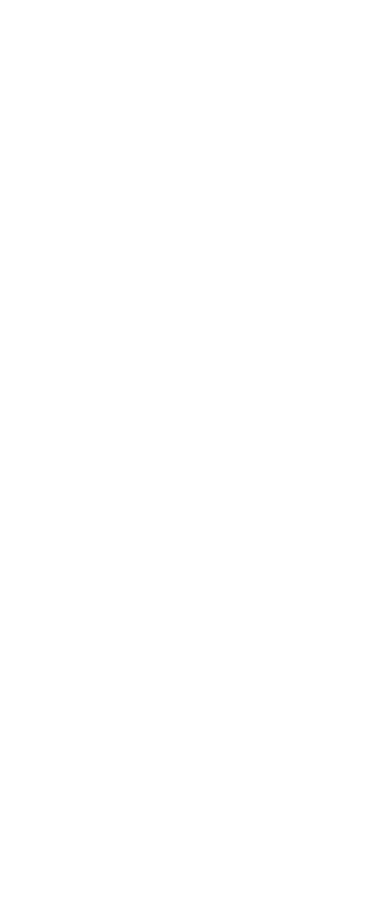
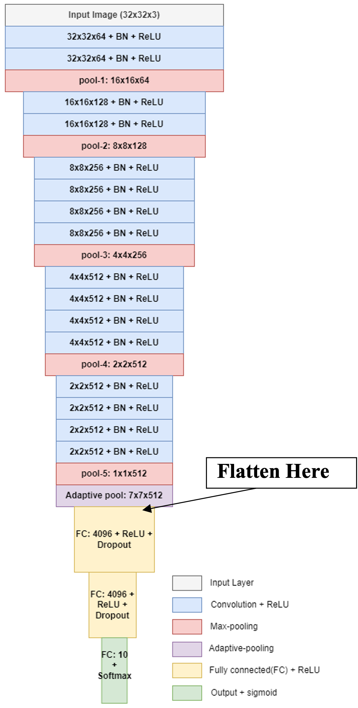
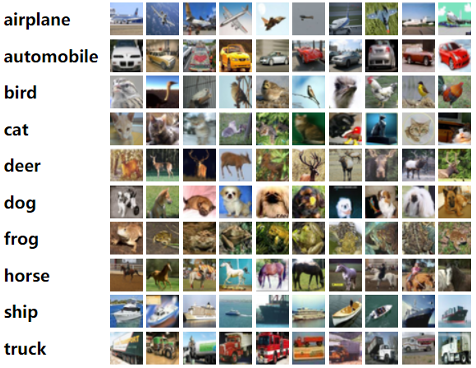
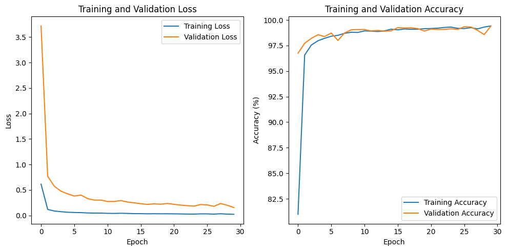
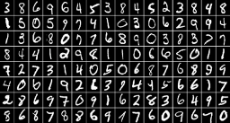
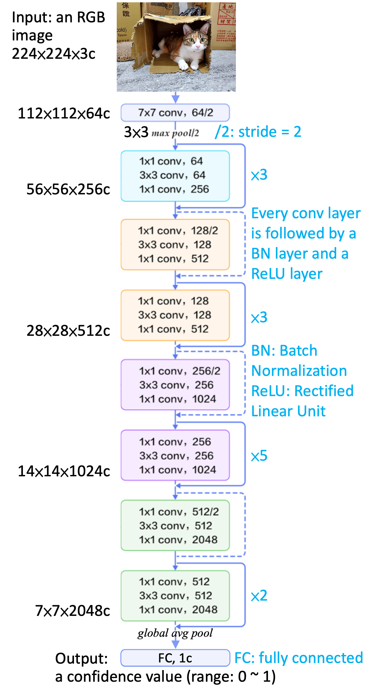
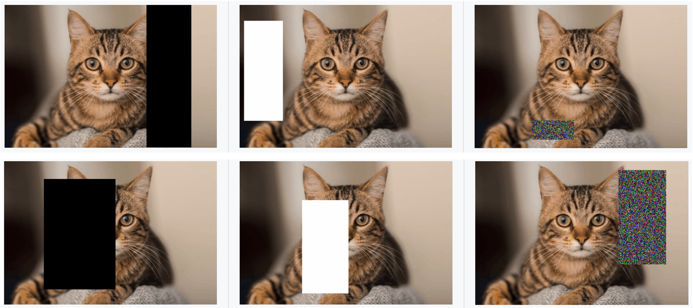
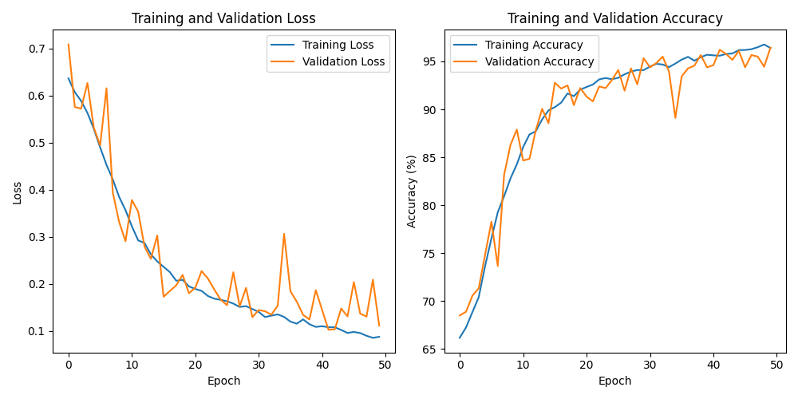
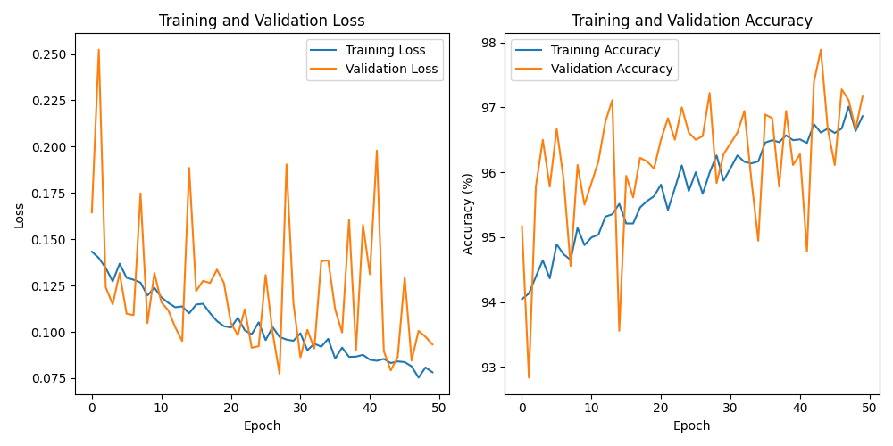

# Training Model Structure for Classification Task

*Discription:*

***1.In this project, we implemented two convolutional neural network architectures, namely VGG19 and ResNet50, for the task of image classification. These architectures are renowned for their effectiveness in various computer vision tasks, including image recognition and classification.***

**1.Requirements and dependencies**
  * Python 3.8 (https://www.python.org/downloads/)
  * Opencv-contrib-python (3.4.2.17)
  * Matplotlib 3.7.3
  * UI framework: pyqt5 (5.15.10)
  * Pytorch 2.1.0
  * Torchvision 0.16.0
  * Torchsummary 1.5.1
  * Tensorboard  2.14.0
  * Pillow 10.1.0

**2.Usage:**

1. Downloads whole repository.
2. Run the file and follow the steps .
3. Automatically download the dataset.
4. Save the model if you want.

## 1.VGG19-CIFAR10

1.Objective :
  
  * Train a VGG19 with BN (Batch Normalization) model to classify 10 different classes images of CIFAR10.

2.Structure discription :

  * VGG19: A convolutional neural network that is 19 layers deep.
  * BN (Batch Normalization): used to make training of artificial neural networks faster and more stable.

3. Training and validating

  * Training and validating VGG19 with BN at least 40 epochs.
  * If your validation accuracy is low, you can try :
      * Adjust the learning rate of the optimizer.
      * Change the data augmentation techniques used.
        

## 2.CIFAR10

1.Dataset discription : 

  * A collection of 60,000 32x32 color images in 10 different classes that is commonly used to train machine learning and computer vision algorithms.
  * 10 classes: airplane, automobile, bird, cat, deer, dog, frog, horse, ship, truck.
  * Datasets :
      * Training dataset: 50000 images in total.
      * Validation dataset: 10000 images in total.
      * Testing dataset: 10 images in total. (Generating from validation dataset.)

## 3.VGG19-MNIST

1.Parameters :

   * At least 30 epochs.
   * Cross entropy loss.
   * Adam optimizer.

2.Training and validating : 
   * Training and validating VGG19 with BN at least 40 epochs.
   * If your validation accuracy is low, you can try :
       * Adjust the learning rate of the optimizer.
       * Change the data augmentation techniques used.

## 4.MNIST

1.Dataset discription : 

  * A collection of 60,000 32x32 color images in 10 different classes that is commonly used to train machine learning and computer vision algorithms.
  * 10 classes number from 1~10.
  * Datasets :
      * Training data: 60000 images.
      * Validation data: 10000 images.
      * Resize image to (32, 32).

## 1.ResNet50-Cat/Dog

1.Objective :
  
  * Train a ResNet50 model to classify images of cats and dogs using PyTorch.

2.Structure discription :

  * Build a ResNet50 model.

  * Replace the output layer to a FC (Fully Connected) layer of 1 node with a Sigmoid activation function

3. Training and validating
   
  * Improve ResNet50 with Random-Erasing.
        

  * Original : 

  * Improve feature :

